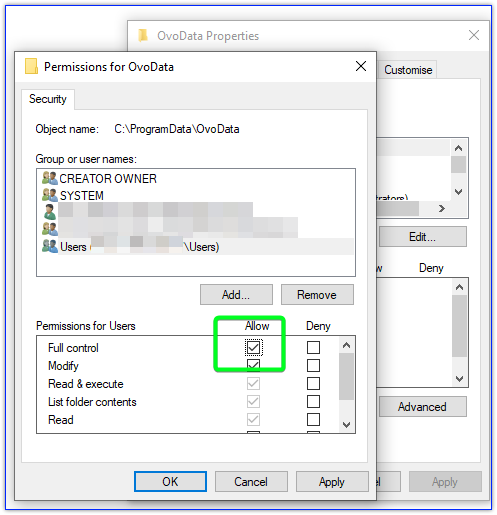

Get your energy usage data from OVO via it's API.

There have been reports that some Windows 11 users require this to be run elevated (as admin).
This is probably due to permissions to the folder C:\ProgramData.

If this affects you please create the above folder and assign "Full control" to the Users Group

If you like my work, please consider donating at https://www.buymeacoffee.com/mikewilliamsuk

When the application is first run you will see this screen.

Enter your details, then click on the Login button.

Once logged in you will be able to select which of your accounts that you wish to obtain data for.

The screen will also show the date ranges for which data is stored in the SQLite database.

The first time that you use the application on an account it is recomended to select "All Time" then click on the "Get Usage" then Get Readings buttons.

On subsequent occasions you will need to select the appropriate time period,  then click on the "Get Useage" and/or "Get Readings" buttons.

To Export your data in either CSV or Excel format use the "Export" button.

All data is stored in the folder C:\ProgramData\OvoData.

# Disclaimer

THIS IS NOT AN OFFICIAL OVO ENERGY APPLICATION OR LIBRARY.

I have no affiliation with the company. I am a private individual providing this code in the hope that it will be useful. I also recommend that you use their official portal to check your energy consumption. Use this code and this application at your own risk.
